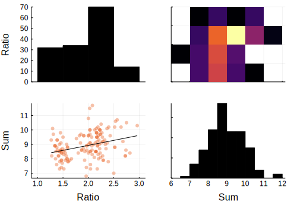
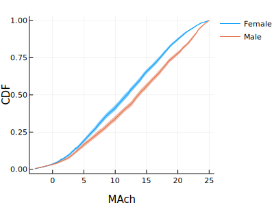
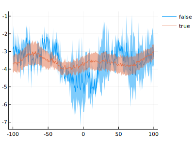

class: middle, centre
# Open source tools for working with data

---

# Introduction

Open source software development for research:

mtmbplxppcxdivelwxrmnbwporxboafacdllggizqdyzaufzrv
- Efficient format for tabular data
mtmbplxppcxdivelwxrmnbwporxboafacdllggizqdyzaufzrv
- User-friendly tools for tabular data manipulations
mtmbplxppcxdivelwxrmnbwporxboafacdllggizqdyzaufzrv
- Plotting facilities for tabular data (esp. grouped data)
mtmbplxppcxdivelwxrmnbwporxboafacdllggizqdyzaufzrv
- Custom array type to incorporate photometry or recordings in tables
mtmbplxppcxdivelwxrmnbwporxboafacdllggizqdyzaufzrv
- Toolkit to build web apps following "data flow"

---

# The Julia programming language
mtmbplxppcxdivelwxrmnbwporxboafacdllggizqdyzaufzrv
- Modern, open-source and free programming language
mtmbplxppcxdivelwxrmnbwporxboafacdllggizqdyzaufzrv
- Easy to use (interactive console, little "boilerplate") but good performance
mtmbplxppcxdivelwxrmnbwporxboafacdllggizqdyzaufzrv
- Rich type system and multiple dispatch allow for fast custom data structures
mtmbplxppcxdivelwxrmnbwporxboafacdllggizqdyzaufzrv
- Metaprogramming: Julia can modify its own code before running it

---

# StructArrays: flexibly switching from row-based to column-based

```@example 1
using StructArrays
s = StructArray(a=1:3, b=["x", "y", "z"])
s[1] # Behaves like an array of structures
```

mtmbplxppcxdivelwxrmnbwporxboafacdllggizqdyzaufzrv

```@example 1
map(row -> exp(row.a), s) # Behaves like an array of structures
```

mtmbplxppcxdivelwxrmnbwporxboafacdllggizqdyzaufzrv

```@example 1
fieldarrays(s) # Data is stored as columns
```

---

# StructArrays: technical highlights

mtmbplxppcxdivelwxrmnbwporxboafacdllggizqdyzaufzrv

- Arbitrary column array types are supported:
    - distributed arrays for parallel computing on a cluster
    - cuda arrays to run operations on cuda kernels

mtmbplxppcxdivelwxrmnbwporxboafacdllggizqdyzaufzrv

```julia
using CuArrays
a = CuArray(rand(Float32, 10))
b = CuArray(rand(Bool, 10))
StructArray(a = a, b = b)
```

mtmbplxppcxdivelwxrmnbwporxboafacdllggizqdyzaufzrv
-  for immutable structs (`namedtuple` in Python, non-existent in Matlab) of "plain data types" (i.e. no pointers), row iteration does not allocate

mtmbplxppcxdivelwxrmnbwporxboafacdllggizqdyzaufzrv

```@example
using StructArrays, BenchmarkTools #hide
a = rand(Float32, 26)
b = rand(Bool, 26)
c = 'a':'z'
s = StructArray(a = a, b = b, c = c)
@btime $s[3]
```

---

# Working with tabular data

```@example 2
using Statistics # hide
using JuliaDBMeta
iris = loadtable("/home/pietro/Data/examples/iris.csv")
```


---

# Working with columns

External packages implement normal tabular data operations on `StructArrays` (map, filter, join, groupby, etc...) as well as macros to use symbols as if they were columns:

```@example 2
@with iris mean(:SepalLength) / mean(:SepalWidth)
```

mtmbplxppcxdivelwxrmnbwporxboafacdllggizqdyzaufzrv

```@example 2
@groupby iris :Species (Mean = mean(:SepalLength), STD = std(:SepalWidth))
```

---

# Working with rows

```@example 2
@apply iris begin
    @transform (Ratio = :SepalLength / :SepalWidth, Large = :PetalWidth > 2)
    @filter :Ratio > 2 && :Species != "versicolor"
end
```

---

# Plotting can be part of the pipeline

```julia
using StatsPlots
@apply iris begin
    @transform (Ratio = :SepalLength/:SepalWidth, Sum = :SepalLength+:SepalWidth)
    @df corrplot([:Ratio :Sum])
end
```


---

# Plotting grouped data

```@example 2
school = loadtable("/home/pietro/Data/examples/school.csv")
```

---

# Plotting grouped data

```julia
using GroupedErrors
@> school begin
    @splitby _.Sx
    @across _.School
    @x _.MAch
    @y :cumulative
    @plot plot(xlabel = "MAch", ylabel = "CDF")
end
```


---

# Adding neural data to a table: ShiftedArrays

In a typical dataset, recordings and behavior are mismatched:
- Behavioral data => hundreds of rows (trials)
- Neural data => hundreds of thousands of frames (photometry)

mtmbplxppcxdivelwxrmnbwporxboafacdllggizqdyzaufzrv

The package ShiftedArrays addresses this issue by creating a custom array type which is a normal array with a shift:

mtmbplxppcxdivelwxrmnbwporxboafacdllggizqdyzaufzrv

```@example 3
using Statistics #hide
using ShiftedArrays
v = rand(10)
lead(v, 3)
```

---

# Adding neural data to a table: ShiftedArrays

The underlying data is shared, so creating a `ShiftedArray` is very cheap:

```@example 3
using BenchmarkTools # hide
v = rand(1_000_000)
@benchmark lead($v, 100)
```

---

# Adding neural data to a table: ShiftedArrays

A new column can be added by simply putting shifted copies of the recordings:

```@example 3
photometry = rand(100)
timestamps = [12, 23, 48, 97]
shiftedvecs = [lead(photometry, time) for time in timestamps]
ShiftedArrays.to_array(shiftedvecs, -5:5)
```

---

# Adding neural data to a table: ShiftedArrays

ShiftedArrays also provides utility function to reduce the data:

```@example 3
reduce_vec(mean, shiftedvecs, -5:5)
```

---

# Plotting support provided by GroupedErrors

```julia
@> df begin
    @splitby _.treatment
    @across _.subject
    @x -100:100 :discrete
    @y _.signal
    @plot plot() :ribbon
end
```



---

# Easy web based interfaces: Interact

- Create web-based interactive interfaces with little code
- Works (in theory) locally with electron, from a server, on the jupyter notebook and in atom

<iframe src="../interact.mp4" width="640" height="360" frameborder="0" webkitallowfullscreen mozallowfullscreen allowfullscreen></iframe>

---

### Widgets and logic:

```julia
using StatsPlots, Interact
color = colorpicker()
npoints = slider(10:100, label = "npoints")
markersize = slider(3:10, label = "markersize")
label = textbox("insert legend entry")

plt = Interact.@map scatter(
    rand(&npoints), rand(&npoints),
    color = &color,
    markersize = &markersize,
    label = &label
)
```

mtmbplxppcxdivelwxrmnbwporxboafacdllggizqdyzaufzrv

### Layout:


```julia
ui = vbox(
    color,
    npoints,
    markersize,
    label,
    plt
)
```

---

### Widgets and logic:

```julia
using JuliaDBMeta, TableWidgets
filename = filepicker()
placeholder = table((a = ["Load a real table"],))
input_data = Interact.@map isempty(&fn) ? placeholder : loadtable(&fn)
filtered_data = selectors(input_data)
edited_data = dataeditor(filtered_data)
viewer = dataviewer(edited_data)
```

mtmbplxppcxdivelwxrmnbwporxboafacdllggizqdyzaufzrv

### Layout:

```julia
tabs = OrderedDict(
    :filename => filename,
    :filtered_data => filtered_data,
    :edited_data => edited_data,
    :viewer => viewer
)
ui = tabulator(tabs)
```

---

# More interactive plotting

A newer plotting framework ([Makie](http://juliaplots.org/MakieGallery.jl/stable/index.html) by Simon Danisch: Julia + OpenGL) provides enhanced interactivity in two ways:
- Excellent rendering performance (interactive speed with large datasets)
- The plot and the UI controls can share signals.

mtmbplxppcxdivelwxrmnbwporxboafacdllggizqdyzaufzrv

**Disclaimer**: I've ported the StatsPlots package to StatsMakie but there are still some quirks to iron out before I can switch to using it exclusively.

---

# Eye catching demos (in house): Makie for whole brain neural activity (cFOS)

<iframe src="../mesh_neurons.mp4" width="640" height="360" frameborder="0" webkitallowfullscreen mozallowfullscreen allowfullscreen></iframe>

Data and classification from Diogo Matias

---

# Eye catching demos (in the wild): combining Makie and Interact

<iframe src="../orbitdiagram.mp4" width="640" height="360" frameborder="0" webkitallowfullscreen mozallowfullscreen allowfullscreen></iframe>

Video Credits: George Datseris and JuliaDynamics organization

---


# References

[StructArrays](https://github.com/piever/StructArrays.jl)

[JuliaDBMeta](https://piever.github.io/JuliaDBMeta.jl/latest/)

[StatsPlots](https://github.com/JuliaPlots/StatsPlots.jl)

[GroupedErrors](https://github.com/piever/GroupedErrors.jl)

[ShiftedArrays](https://github.com/piever/ShiftedArrays.jl)

[Interact](https://github.com/JuliaGizmos/Interact.jl)

[TableWidgets](https://github.com/piever/TableWidgets.jl)

[Makie](http://juliaplots.org/MakieGallery.jl/stable/index.html)
